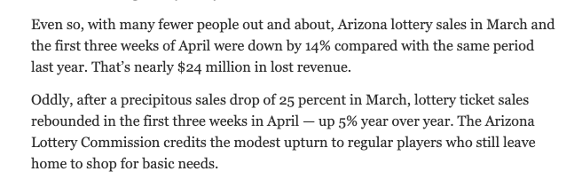

This page contains the data work behind an [Arizona Republic story](https://www.azcentral.com/story/news/local/arizona/2020/04/29/shoppers-off-streets-state-lottery-revenues-may-decline/3047914001/) about playing the lottery during the coronavirus pandemic. We wanted to find out how safety concerns and the statewide stay-at-home order had impacted ticket sales.

The analysis is simple: an easy year-to-year comparison of sales data. Data for March was provided to us as a lump sum figure, and April sales data was provided in Excel files. Here we go.


*Photo by Patrick Breen/The Republic*
```{r, message = FALSE, include = FALSE }

library( tidyverse )
library( readxl )
library( readr )
library( janitor )
library( lubridate )

```

#### Load the data

First, let's load the April sales data for 2019 and 2020. These files were provided on April 21, 2020 by John Gilliland, the public information officer for the Arizona Lottery. The spreadsheets contain daily sales for all lottery games.

Warning: the Excel file contains a 'TOTAL' row that we need to remove. I'm also specifying the column types upon load, since R otherwise doesn't know the first column is a date.
``` {r, message = FALSE, warning = FALSE}

april2019_sales <-
  read_excel(
    "data/DailySales_04012019thru04302019.xlsx",
    col_types = c(
      "date",
      "guess", "guess", "guess", "guess", "guess", "guess", "guess", "guess", "guess", "guess", "guess", "guess", "guess", "guess"
    )
  ) %>%
  clean_names() %>% 
  filter( !is.na( calendar_date ) )

april2020_sales <-
  read_excel(
    "data/DailySales_04012020thru04212020.xlsx",
    col_types = c(
      "date",
      "guess", "guess", "guess", "guess", "guess", "guess", "guess", "guess", "guess", "guess", "guess", "guess", "guess", "guess"
    )
  ) %>%
  clean_names() %>% 
  filter( !is.na( calendar_date ) )

```

Run a few checks: Does the `total_sales` column accurately reflect the total sales on that day?

Note that some columns are a summation of the others. We need only to look at "online sales" (a Lottery term for draw games like Mega Millions and Powerball), "scratchers" and pull tabs to reach the total.
```{r}

april2019_sales %>% 
  mutate( 
    total_check =  online_sales + scratcher_sales + pull_tabs_sales
  ) %>% 
  filter( total_sales != total_check )

april2020_sales %>% 
  mutate( 
    total_check =  online_sales + scratcher_sales + pull_tabs_sales
  ) %>% 
  filter( total_sales != total_check )

```
From the empty output above, we know the `total_sales` row is accurate and safe to use.

Gilliland also provided sales figures for lottery games in the month of March. The exact values can be found in the PDF of our email, saved as `20200421_email_arizona_lottery_data.` We'll create variables to hold those values:

```{r}

march2019_sales <- 110087268

march2020_sales <- 82588960

```

Already, we can run a quick check on how sales compare in March between the two years.
```{r}

# how much did sales change from year to year?
( ( march2020_sales - march2019_sales ) / march2019_sales ) * 100

```

#### Lottery sales were down about 25% in March compared to last year.

Now, let's run a similar comparison for April sales between 2019 and 2020. Because the latest data we could obtain included only the first three weeks of April, we'll need to truncate our table of `april2019_sales` to match the same time frame.

```{r}

april2019_sales <- april2019_sales %>% filter( calendar_date <= "2019-04-21" )

```

Now calculate the percent change:

``` {r}

# how much did sales change from year to year?
( ( sum( april2020_sales$total_sales ) - sum( april2019_sales$total_sales ) ) / sum( april2019_sales$total_sales ) ) * 100

```

#### Sales for the first three weeks of April are up by 5.6% compared to 2019.

That's pretty surprising, given the 25% drop in March. Which games are doing poorly, and which games are doing well? We can summarise the day-by-day data to get a weekly comparison.
```{r}

# weekly sales by game - 2020
weekly_sales_april2020 <- april2020_sales %>% 
  mutate( 
    week = case_when( calendar_date <= "2020-04-07" ~ 1,
                       calendar_date > "2020-04-07" & calendar_date <= "2020-04-14" ~ 2,
                       calendar_date > "2020-04-14" ~ 3 )
    ) %>% 
  group_by( week ) %>% 
  summarise( days = n( ),
             draw_games = sum( online_sales ),
             scratcher_sales = sum( scratcher_sales ),
             pull_tabs = sum( pull_tabs_sales ),
             total = sum( total_sales ) )

# weekly sales by game - 2019
weekly_sales_april2019 <- april2019_sales %>% 
  mutate( 
    week = case_when( calendar_date <= "2019-04-07" ~ 1,
                       calendar_date > "2019-04-07" & calendar_date <= "2019-04-14" ~ 2,
                       calendar_date > "2019-04-14" ~ 3 )
    ) %>% 
  group_by( week ) %>% 
  summarise( days = n( ),
             draw_games = sum( online_sales ),
             scratcher_sales = sum( scratcher_sales ),
             pull_tabs = sum( pull_tabs_sales ),
             total = sum( total_sales ) )
```

Compare: 
```{r}

weekly_sales_april2020 %>% left_join( weekly_sales_april2019,
                                      by = c( "week" = "week" ),
                                      suffix = c( "_20", "_19" ) ) %>% 
  mutate( diff_draw_games = draw_games_20 - draw_games_19,
          diff_scratcher = scratcher_sales_20 - scratcher_sales_19,
          diff_pull_tabs = pull_tabs_20 - pull_tabs_19,
          diff_total = total_20 - total_19 ) %>% 
  select( week, starts_with( "diff" ) )

```

We see that sales for all games are still down in April nearly across the board - except for scratcher games, which sold so many tickets in the third week that they nearly made up for other losses. Looking closer at that week of data shows that sales ballooned on April 21st, totaling almost three times the earnings on earlier days.
```{r}

april2020_sales %>% 
  filter( calendar_date > "2020-04-14" ) %>% 
  select( calendar_date, scratcher_sales )

```
At first, we wondered if this was an error. Gilliland told us no, it wasn't wrong - just a reflection of converting to a new accounting system, which led to a backlog of tickets recorded that day. The Arizona Lottery data shows when a ticket "settles," or is recognized by the state, which may not always be the same day the ticket was sold.

Our reporting also showed that lottery sales fluctuate with jackpot values and the state portfolio of games. People tend to buy more tickets when Powerball and Mega Millions skyrocket, and the Arizona Lottery regularly introduces new games and incentives for players. These could impact demand as much as a pandemic-era urge to stay home. 

In short, it would be better to compare the data for broad time periods - March, April, or the seven weeks combined - rather than on a daily basis. Our analysis still shows that scratcher games are a powerful revenue engine for the state lottery, boosting sales enough to compensate for flagging interest in other games.

Finally, let's combine all our data to compare sales from March 1 - April 21.
```{r}

allsales_2019 <- march2019_sales + sum( april2019_sales$total_sales )

allsales_2020 <- march2020_sales + sum( april2020_sales$total_sales )

```

Calculate:
```{r}

# how much did sales change from year to year?
( ( allsales_2020 - allsales_2019 ) / allsales_2019 ) * 100

# what was the change in dollars?
allsales_2020 - allsales_2019

```

#### Lottery revenues are down by 14% in March and the first three weeks of April.
That's nearly $24 million in lost revenue.

You'll see these findings included in the published story:

.

